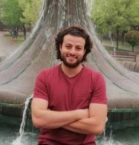

# 

*Hi, my name is [**Saif Saeed**](https://github.com/Saif-K-Saeed) I am 32 years old  I am from Jordan I am a second-year software engineering student at **ASAC***

## Table of content code-102

*Neme of the read* | *Link of it*
---------- |------------|
Growth Mindset  | [vist it](https://saif-k-saeed.github.io/reading-notes/growthMindset)
read01(Markdown) | [vist it](https://saif-k-saeed.github.io/reading-notes/read1)
read02(GUI) | [vist it](https://saif-k-saeed.github.io/reading-notes/read02)
read03(HTML) | [vist it](https://saif-k-saeed.github.io/reading-notes/read03)
read04(js) | [vist it](https://saif-k-saeed.github.io/reading-notes/read04)
read05(Operators and Loop) | [vist it](https://saif-k-saeed.github.io/reading-notes/read05)
read06(css) | [vist it](https://saif-k-saeed.github.io/reading-notes/read06)
read07(Functions) | [vist it](https://saif-k-saeed.github.io/reading-notes/read07)

## Table of content code-201

 *Neme of the read* | *Link of it*
---------- |------------|
class01 | [vist it](https://saif-k-saeed.github.io/reading-notes/class01)
class02 | [vist it](https://saif-k-saeed.github.io/reading-notes/class02)
class03 | [vist it](https://saif-k-saeed.github.io/reading-notes/class03)
class04 | [vist it](https://saif-k-saeed.github.io/reading-notes/class04)
class05 | [vist it](https://saif-k-saeed.github.io/reading-notes/class05)
class06 | [vist it](https://saif-k-saeed.github.io/reading-notes/class06)
class07 | [vist it](https://saif-k-saeed.github.io/reading-notes/class07)
class08| [vist it](https://saif-k-saeed.github.io/reading-notes/class08)
