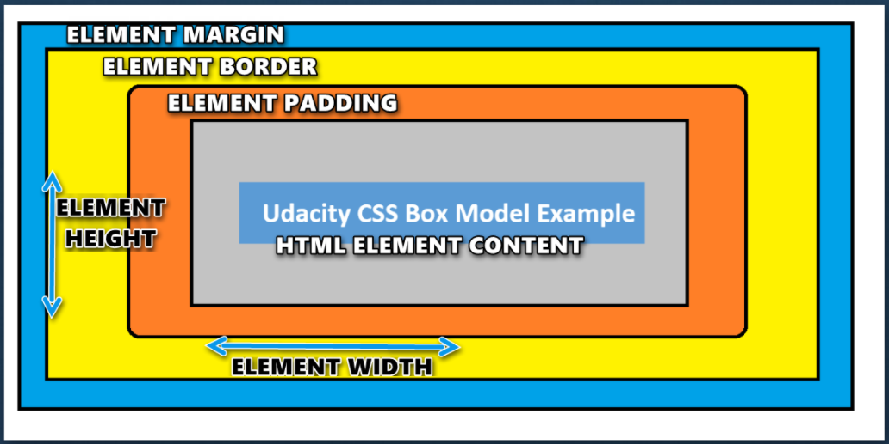

#

## HTML Lists

HTML lists allow web developers to group a set of related items in lists.

An unordered HTML list | An ordered HTML list:
----------------------|----------------------
|- Item  | 1- First item|
|- Item  | 2- Second item
|- Item  | 3- Third item
|- Item  | 4- Fourth item
----------

### **Unordered HTML List**

An unordered list starts with the `<ul>` tag. Each list item starts with the `<li>` tag.
The list items will be marked with bullets (small black circles) by default.

### **Ordered HTML List**

An ordered list starts with the `<ol>` tag. Each list item starts with the `<li>` tag.
The list items will be marked with numbers by default.

### **HTML Description Lists**

HTML also supports description lists.
A description list is a list of terms, with a description of each term.

The `<dl>` tag defines the description list, the `<dt>` tag defines the term (name), and the `<dd>` tag describes each term.

### **HTML List Tags**

*Tag*  |  *Description*
-----|----------
`<ul>`| Defines an unordered list
`<ol>`| Defines an ordered list
`<li>`| Defines a list item
`<dl>`| Defines a description list
`<dt>`| Defines a term in a description list
`<dd>`| Describes the term in a description list

## CSS Box Model

## **What Is the CSS Box Model?**

The CSS Box Model is a term used for the container that wraps the following element properties within it.

- Margin
- Border
- Padding
- Content
- Height and Width

## What is JavaScript?

- JavaScript is the **Programming Language** for the Web.

- JavaScript can update and change both **HTML** and **CSS**.

- JavaScript can **calculate**, **manipulate** and **validate** data.

### **JavaScript variables can be**

- Numbers
- Strings
- Objects
- Arrays
- Functions

*name*  | *Example*
----- |--------
Numbers |`var` x = 3.14;`var` y = 3;
Strings|`var` carname = "Volvo XC60";  `var` carname = 'Volvo XC60';
Objects|`var` car = `{type:"Fiat", model:"500", color:"white"}`;
Arrays|`var` cars = `["Saab", "Volvo", "BMW"]`;
Functions |function myFunction(p1, p2) { `return p1 * p2;`   `of p1 and p2`}

## **Operators and Loop**

## Operators

An operator, in computer programing, is a symbol that usually represents an action or process. These symbols were adapted from mathematics and logic. An operator is capable of manipulating a certain value or operand.

Operators are the backbone of any program and they are used for everything from very simple functions like counting to complex algorithms like security encryption.

## TRUTHY & FALSY VALUES

When you write `if/else` statement in any programming language, you expect to pass a value in the `if()` condition that is strictly `boolean` which means either `true` or `false`. It could also be an expression that evaluates to one of these values as demonstrated below.

**falsy**  -> false, '', "", 0, -0, 0n, NaN, null, undefined

**truthy** -> anything that is not mentioned above

## Loop

Loops are handy, if you want to run the same code over and over again, each time with a different value.

### **Different Kinds of Loops**

- for - loops through a block of code a number of times

`for` (statement 1; statement 2; statement 3) {

  // code block to be executed

}

- for/in - loops through the properties of an object

`for` (key in object) {

  // code block to be executed

}

- for/of - loops through the values of an iterable object

`for` (variable of iterable) {

  // code block to be executed
  
}

- while - loops through a block of code while a specified condition is true

`while` (condition) {
  // code block to be executed

}

- do/while - also loops through a block of code while a specified condition is true

`do` {

  // code block to be executed
}

`while` (condition);

by ***Saif Saeed***  [GitHup](https://github.com/Saif-K-Saeed)
