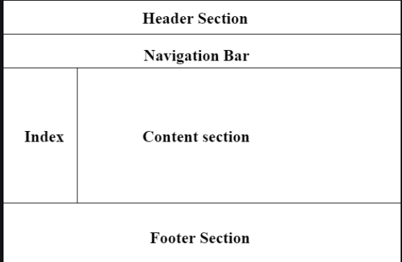

#

## HTML Links

Links are found in nearly all web pages. Links allow users to click their way from page to page.

## HTML Links - Hyperlinks

- HTML links are hyperlinks.

- You can click on a link and jump to another document.

- When you move the mouse over a link, the mouse arrow will turn into a little hand.

### HTML Links - Syntax

The HTML `<a>` tag defines a hyperlink. It has the following syntax:

`<a href="url">link text</a>`

### HTML Links - The target Attribute

By default, the linked page will be displayed in the current browser window. To change this, you must specify another target for the link.

The target attribute specifies where to open the linked document.

The target attribute can have one of the following values:

- self - Default. Opens the document in the same window/tab as it was clicked
- blank - Opens the document in a new window or tab
- parent - Opens the document in the parent frame
- top - Opens the document in the full body of the window

 `<a href="https://www.Google.com/" target="_blank">Visit Google!</a>`

### HTML Links - Use an Image as a Link

To use an image as a link, just put the `` tag inside the `<a>` tag:

````

### Link to an Email Address

Use `mailto:` inside the `href` attribute to create a link that opens the user's email program (to let them send a new email):

`<a href="mailto:someone@example.com">Send email</a>`

### Button as a Link

To use an HTML button as a link, you have to add some JavaScript code.

JavaScript allows you to specify what happens at certain events, such as a click of a button:

 ``<button onclick="document.location='default.asp'">HTML Tutorial</button>``

### Link Titles

The `title` attribute specifies extra information about an element. The information is most often shown as a tooltip text when the mouse moves over the element.

``<a href="https://www.Google.com/html/" title="Go to Google ">Visit our HTML Tutorial</a>``

## HTML | Layout

Page layout is the part of graphic design that deals with the arrangement of visual elements on a page. Page layout is used to make the web pages look better. It establishes the overall appearance, relative importance, and relationships between the graphic elements to achieve a smooth flow of information and eye movement for maximum effectiveness or impact.

Page Layout Information:

- **Header:** The part of a front end which is used at the top of the page.`<header>` tag is used to add header section in web pages.
- **Navigation bar:** The navigation bar is same as menu list. It is used to display the content information using hyperlink.
- **Index / Sidebar:** It holds additional information or advertisements and is not always necessary to be added into the page.
- **Content Section:** The content section is the main part where content is displayed.
- **Footer:** The footer section contains the contact information and other query related to web pages. The footer section always put on the bottom of the web pages. The `<footer>` tag is used to set the footer in web pages.

## JavaScript

- Objects
- Arrays
- Functions

name  | Example
----- |--------
Objects|`var` car = `{type:"Fiat", model:"500", color:"white"}`;
Arrays|`var` cars = `["Saab", "Volvo", "BMW"]`;
Functions |function myFunction(p1, p2) { `return p1 * p2;`   `of p1 and p2`}
