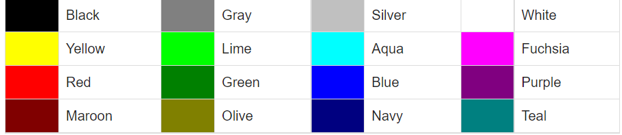
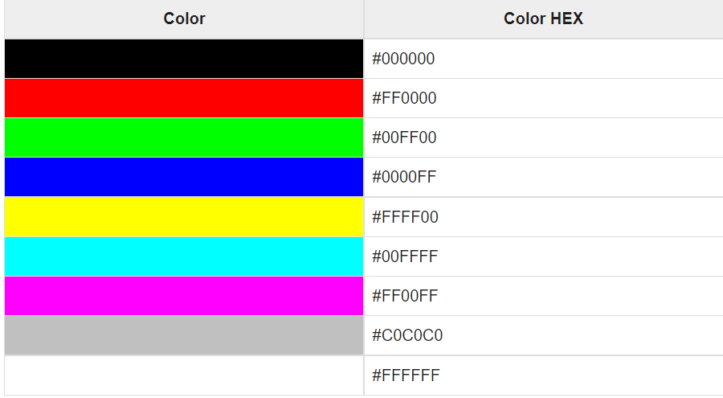
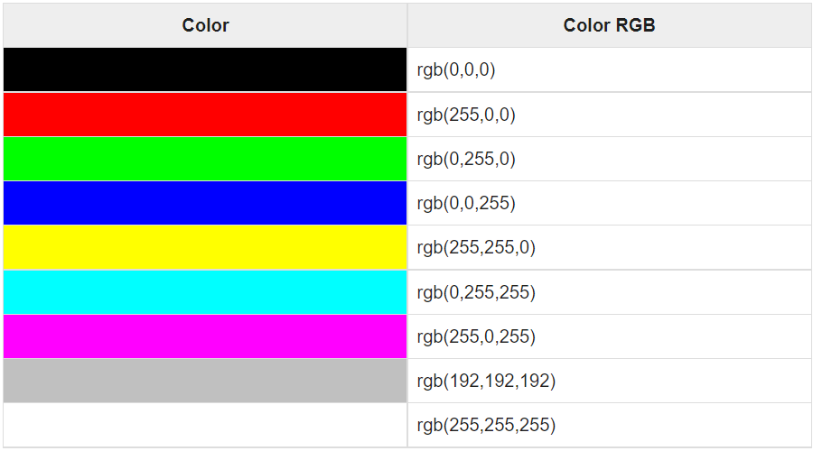

#

## HTML Images

Images are very important to beautify as well as to depict many complex concepts in simple way on your web page.

---

### Attributes of HTML img tag

The src and alt are important attributes of HTML img tag. All attributes of HTML image tag are given below.

1) src
It is a necessary attribute that describes the source or path of the image. It instructs the browser where to look for the image on the server.

The location of image may be on the same directory or another server.

2- alt
The alt attribute defines an alternate text for the image, if it can't be displayed. The value of the alt attribute describe the image in words. The alt attribute is considered good for SEO prospective.

3- width
It is an optional attribute which is used to specify the width to display the image. It is not recommended now. You should apply CSS in place of width attribute.

4- height
It h3 the height of the image. The HTML height attribute also supports iframe, image and object elements. It is not recommended now. You should apply CSS in place of height attribute.

````

---

## HTML Color Coding Methods

There are following three different methods to set colors in your web page −

- **Color names** − You can specify color names directly like green, blue or red.

- **Hex codes** − A six-digit code representing the amount of red, green, and blue that makes up the color.

- **Color decimal or percentage values** − This value is specified using the `rgb( )` property.

### HTML Colors - Color Names



### HTML Colors - Hex Codes



### HTML Colors - RGB Values



---
---

## Html `<text>` tag

The Html `<text>` tag is used to define the single-line text field on a web page.

### Attributes of HTML Text Tag

1- Size

The size attribute is used to define the length of the text field. This attribute accepts the numeric values greater than zero. If you not specify this attribute, by default its value is 20. The following syntax determines how to use this attribute:

`<input type="text" name="firstname" size="Any_numeric_value" />`

2- Value

The value attribute is used to define the value, which is displayed in the text field. The following syntax determines how to use this attribute:

`<input type="text" name="firstname" value=?Any_value? />`  

3- maxlength

The maxlength attribute is used to define a value. This value identifies the maximum number of characters accept by the input. The following syntax determines how to use this attribute:

`<input type="text" name="firstname" maxlength="5" />`  

4- minlength

The maxlength attribute is used to define a value. This value identifies the minimum number of characters accept by the input. The following syntax determines how to use this attribute:

`<input type="text" name="firstname" minlength="5" />`
  
  ---
  
## JPEG vs PNG vs GIF

  GIF, JPEG and PNG are the primary graphic formats used on the Internet, and are also variously employed in print, presentation and multimedia design. All three formats utilize compression techniques for saving images in reduced file size.

**GIF, pronounced either gif or jif**, is supported by all Web browsers although licensing may be required in certain instances. GIF is currently the only option for putting animation on the Internet aside from Flash.

- Supports 8-bit colors (256 colors)
- Features background transparency and animation (requires image
editing/animation program)
- Used for line drawings, icons and simple logos. Should not be used for photos
or graphics with complex colors or gradients.
- Image quality never degrades with resaves

**JPEG, prounouced jaypeg**, is also supported by all Web browsers.

- Supports 24-bit colors (16.7 million colors)
- Used for photographic images and graphics with complex colors and gradients
- Image quality degrades slightly when a JPEG is resaved. The information that is discarded in JPEG compression cannot usually be detected by the human eye at first. Howevever, over time and with subsequent resaves, image detail is lost.
- No background transparency

**PNG, pronounced ping,** is the newest graphic format and is designed to be an improved, free successor to GIF format. The PNG format is not yet supported by all browsers, although this is changing.

- Supports 24-bit colors (16.7 million colors)
- Features background transparency (requires image editing program)
- Does not support animation
- Image quality never degrades with resaves
- Older printers may not support PNG transparencies