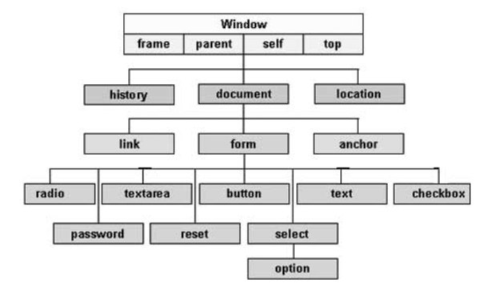

#

## Object Literal

Object Literals
An object literal is “flat”. You create it, you add properties and methods to it, and all of those properties and methods are public. You can mutate any members of that object at any time. A JavaScript object literal does not, by nature, provide private scope. But any of the members of an object literal can certainly be a function that is capable of private scope. Object literals are useful because they allow you to create clean name-spaced code that is easy to pass around and consume.

## Instance Objects

An instance object is what is returned when instantiating a JavaScript constructor function, using the JavaScript “new” keyword. When you say “`var bar = new Foo()`”, “`bar`” becomes an “instance” of the function “`Foo()`”. Any expressions within `Foo()` are executed, any local variables in `Foo()` are copied and provided in “`bar`”, and the value of “`this`” inside of “`bar`”, refers to “`bar`”. The function “`Foo`” is never changed in any way; it simply acts as a “blueprint” for “`bar`”, and “`bar`” is an “instance” of “Foo”. Any local variables inside of “`bar`” are completely private and can only be muted by privileged members of that object.

-----------

## JavaScript - Document Object Model

Every web page resides inside a browser window which can be considered as an object.

A Document object represents the HTML document that is displayed in that window. The Document object has various properties that refer to other objects which allow access to and modification of document content.

The way a document content is accessed and modified is called the **Document Object Model**, or **DOM**. The Objects are organized in a hierarchy. This hierarchical structure applies to the organization of objects in a Web document.

- **Window object** − Top of the hierarchy. It is the outmost element of the object hierarchy.

- **Document object** − Each HTML document that gets loaded into a window becomes a document object. The document contains the contents of the page.

- **Form object** − Everything enclosed in the `<form>`...`</form>` tags sets the form object.

- **Form control elements** − The form object contains all the elements defined for that object such as text fields, buttons, radio buttons, and checkboxes.

