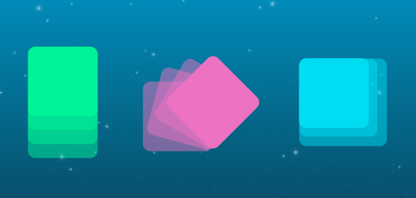

# CSS Animations

## What Are CSS Animations?

The process of animating the objects (or elements) on a web page is known as CSS Animation. Prior to CSS Animations, it was done with JavaScript and associated libraries, which as a developer, you'd know made things excessively complicated. CSS Animations have pre-defined attributes that make it easier to apply and construct end-goals, as well as a variety of possibilities.

Moving animations to CSS instead of JavaScript improves performance since the browser takes control and optimizes the animation for speed. The attributes associated with CSS animations can be separated into three groups:

- **Transformation** – Transforming the dimensions, rescaling the objects, moving them from point A to B, etc.
- T**ransitions** – Performing the transformations smoothly.
- **Keyframes** – Changing the animation (property, value, etc.) at a given time or state.

## Transformations

The transform property in CSS animation makes transformations to the size (rescaling), moving them (translating), rotating them (rotations) or skewing them on the web page. The CSS transform requires four types of values:

- **none**: To define that no transformation is intended on the object.
- **value**: To assign a value such as rotate.
- **inherit**: Inherit the property from the parent element.
- **initial**: Set the value as the default value for the property assigned to the object.

The **“value”** part defined in the above pointer determines what we want to do with the object.
You can replace the value with one of the four options:

type | Syntax
-----|-------|
Translate|`.transform_animation:hover {  transform: translate(100px, 100px);}`|
Scale |`.transform_animation:hover { transform: scale(2,2);}`
Rotate| `.transform_animation:hover { transform: rotate(75deg);}`
Rotate |`.transform_animation:hover {transform: rotate(75deg);}`
Skew |`.transform_animation:hover {transform: skew(30deg, 30deg);}`

## Properties

Property| Description
--------|--------
@keyframes| Specifies the animation code
animation| A shorthand property for setting all the animation properties
animation-delay |Specifies a delay for the start of an animation
animation-direction |Specifies whether an animation should be played forwards, backwards or in alternate cycles
animation-duration| Specifies how long time an animation should take to complete one cycle
animation-fill-mode| Specifies a style for the element when the animation is not playing (before it starts, after it ends, or both)
animation-iteration-count |Specifies the number of times an animation should be played
animation-name |Specifies the name of the @keyframes animation
animation-play-state |Specifies whether the animation is running or paused
animation-timing-function |Specifies the speed curve of the animation
|
by ***Saif Saeed***  [GitHup](https://github.com/Saif-K-Saeed)
